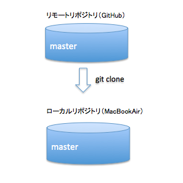
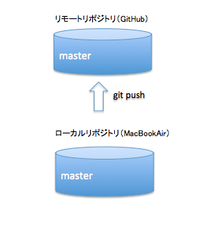
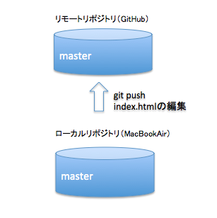

# 第3章：Git基本コマンド
## 前回の復習

### Gitの設定
[Gitの設定](https://github.com/chokaigi/git_lesson/blob/master/lesson/02_Gitを使ってみる.md#6gitの設定)  

## 基本コマンド編
コマンドとしては前回利用したものとほぼ同じですが  
こちらではGitHubへの反映、編集時に行う一連の流れの説明を行います  

・既存のリポジトリの取得【clone】  
・ブランチの作成、切り替え【checkout】  
・リモートリポジトリへの反映【push】  
・作業状況の確認【status】  
・修正の内容を確認【diff】  
・ファイルのステージング【add】  
・修正の記録【commit】  
・ログの確認【log】  

## 1.既存のリポジトリをclone
前回GitHubに登録したリポジトリを取得します

```
MacBookAir:~ tt$ cd /Users/tt/Documents
MacBookAir:Documents tt$ git clone https://github.com/takayukik/myapp.git
Cloning into 'myapp'...
warning: You appear to have cloned an empty repository.
Checking connectivity... done.
```
  


## 2.ブランチを切る

### git branch
今いるブランチを確認します  
*がついているのが今いるブランチです

```
MacBookAir:myapp tt$ git branch
* master
```

### git branch develop1 master

ブランチを切ります

```
MacBookAir:myapp tt$ git branch develop1 master
MacBookAir:myapp tt$ git branch
  develop1
* master
```

git branchでもう一度ブランチを確認してみると
develop1と言うブランチが増えています

```
MacBookAir:myapp tt$ git branch
  develop1
* master
```

## 3.ブランチを移動する

### git checkout ブランチ名

指定したブランチに移動します

```
MacBookAir:myapp tt$ git checkout develop1
Switched to branch 'develop1'
```

git branchで状態を確認してみると
*がdevelop1側に移動しています、この状態でdevelop1側のブランチに移動している状態となります

```
MacBookAir:myapp $ git branch
* develop1
  master
MacBookAir:myapp tt$ 
```

masterに戻ります
今度はmasterを指定してcheckoutすればmasterへ戻ることができます

```
MacBookAir:myapp tt$ git checkout master
Switched to branch 'master'
```

本当に戻ったか確認します
*がmaster側に移動していればmasterへ戻ることができています

```
MacBookAir:myapp tt$ git branch
  develop1
* master
```


## 4.前回の復習で作成したファイルをリモートリポジトリにプッシュ 

### 第１回目で作業した内容まで操作を行う
[Gitの設定から、コミットまでやってみよう](https://github.com/chokaigi/git_lesson/blob/master/lesson/02_Gitを使ってみる.md#7-gitの設定からコミットまでやってみよう)

### git push origin master
前回の復習で作成したindex.htmlをpushします

```
MacBookAir:myapp tt$ git push origin master
Counting objects: 3, done.
Writing objects: 100% (3/3), 216 bytes | 0 bytes/s, done.
Total 3 (delta 0), reused 0 (delta 0)
To https://github.com/takayukik/myapp.git
 * [new branch]      master -> master
```
  

## 5.ファイルの編集＆確認
前回pushしたindex.htmlの編集をします  

```
vim index.html
```

### git status

現在の作業状況が確認できます  

・①現在の作業ブランチ  
・②現在のステージング（add）されていないファイルの一覧  
　※addについては後述

```
MacBookAir:myapp tt$ git status
On branch master  ①
Your branch is up-to-date with 'origin/master'.
Changes not staged for commit: ②
  (use "git add <file>..." to update what will be committed)
  (use "git checkout -- <file>..." to discard changes in working directory)

	modified:   index.html

no changes added to commit (use "git add" and/or "git commit -a")
```

### ローカルリポジトリの状態

| コミット | ステージング | 作業フォルダ |
|:------------:|:------------:|:------------:|
| | | index.html |

### git diff

修正の内容を確認する事ができます  
この例では１行追加しているため「＋編集」と表示されます

```
MacBookAir:myapp tt$ git diff
diff --git a/index.html b/index.html
index 9daeafb..d78b155 100644
--- a/index.html
+++ b/index.html
@@ -1 +1,2 @@
 test
+編集
```

## 6.ファイルのステージング
### git add ファイル名

編集したファイルをステージする(＝次回のコミット対象にする)

```
MacBookAir:myapp tt$ git add index.html
```

### ローカルリポジトリの状態

| コミット | ステージング | 作業フォルダ |
|:------------:|:------------:|:------------:|
| | index.html ← | index.html |


## 7.ステージング確認
### git status

現在の作業状況が確認できます。  

・①現在の作業ブランチ  
・②addすることによりコミットする準備ができた修正 

```
MacBookAir:myapp tt$ git status
On branch master ①
Your branch is up-to-date with 'origin/master'.
Changes to be committed: ②
  (use "git reset HEAD <file>..." to unstage)

	modified:   index.html
``` 

## 8.コミット
### git commit -m ”message”

修正を記録し、履歴として参照できる状態にする

```
MacBookAir:myapp tt$ git commit -m "index.htmlの編集"
[master c0e1bff] index.htmlの編集
 1 file changed, 1 insertion(+)
```

### ローカルリポジトリの状態

| コミット | ステージング | 作業フォルダ |
|:------------:|:------------:|:------------:|
| index.html (index.htmlの編集) ← | index.html | index.html |

## 9.ログの確認
### git log

修正の履歴を確認する事ができます。 
 
・①修正の履歴を特定するハッシュ値  
・②修正者の情報  
・③コミットした時刻  
・④コミットメッセージ　

```
MacBookAir:myapp tt$ git log
commit c0e1bff3e38b33a8287ad4e43e6cc985052be9fa ①
Author: takayukik <takayukik@tt-com.net> ②
Date:   Mon Feb 20 013:07:01 2016 +0900 ③

    index.htmlの編集 ④

commit 8b3e0d5284dfc7744ffadb22f17ac8a24ea89a2a
Author: takayukik <takayukik@tt-com.net>
Date:   Mon Feb 20 13:53:11 2016 +0900

    initial commit

```  

## 10.リモートリポジトリにプッシュ 
### git push origin master

ローカルリポジトリの情報をリモートリポジトリへ反映

```
MacBookAir:myapp tt$ git push origin master 
Counting objects: 3, done.
Writing objects: 100% (3/3), 271 bytes | 0 bytes/s, done.
Total 3 (delta 0), reused 0 (delta 0)
To https://github.com/takayukik/myapp.git
   8b3e0d5..c0e1bff  master -> master
```
 

## 演習問題
1. 編集したファイルについて、以前のコミットした状態と差分を比較するコマンドは何ですか。
* 編集したファイル状態を確認するコマンドは何ですか。
* 作業ディレクトリの状態にある編集したファイルをステージングエリアへ追加するコマンドは何ですか。
* ローカルリポジトリに編集したファイルを最終的に反映するコマンドは何ですか。
* コミットしたログを確認するコマンドは何ですか。
* ローカルリポジトリにコミットした内容をリモートリポジトリに反映するコマンドは何ですか。
* ローカルで任意のファイルを編集し、リモートリポジトリまで反映させてください。（コミットのコメントは何でもOKです。）
* リモートリポジトリmyappをローカルPCの別のフォルダに取得してください。
* 前演習問題で取得したmyappのmasterブランチから別ブランチdevelopAを作成してください。
* 前演習問題で作成したdevelopAに新しいファイルtest.htmlを作成し、コミット後、リモートリポジトリに反映してください。
* 前演習問題で作成したdevelopAからmasterブランチに切り替えを行ってみてください。