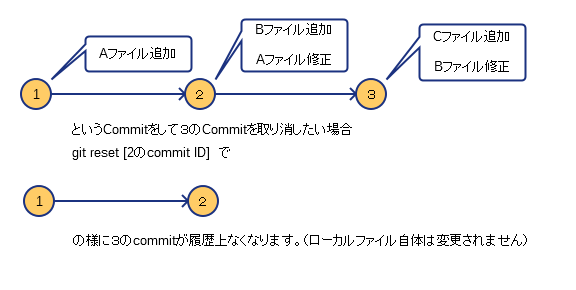

# 第2回Git勉強会

## こんなときどうする編
今までの説明以外で業務上起こりうるよくあるパターンをやってみましょう

## 1.変更をなかったコトにしたい
どんなケースか  
「前回のコミットからソースをいじったけどコミットせず元に戻したい」  
・git checkout .   
これで現在のディレクトリ下のファイルを戻せます。  

そのほかにも指定ファイルを元に戻す事が可能です  
git checkout [ファイル名]  

```
$ vi ccc.txt
「作業：viで新規ファイルを作成」
$ ls
ccc.txt
$ git add ccc,txt
$ git commit -m test
「作業：新規ファイルのcommit」

$ vi ccc.txt
「作業：viでファイルの内容を修正」

$ git diff
diff --git a/ccc.txt b/ccc.txt
index 259b241..543209f 100644
--- a/ccc.txt
+++ b/ccc.txt
@@ -1,2 +1,4 @@
 test
 test1
+test
+test1
warning: LF will be replaced by CRLF in ccc.txt.
The file will have its original line endings in your working directory.
$ git checkout ccc.txt
「作業：修正したファイルを元に戻す」

$ git diff
```

## 2.コミット済みのスナップショットを元にもどす
コミットしたけど仕様上不要になって何個か前のコミットまで戻したいケース  
git reset [CommitID]  
※指定するCommitIDは戻したい履歴まで。その次以降はCommit履歴が消えます)    
で  


```
$git reset (2のCommitID)  
```
で２まで取り消します。（３の履歴はツリー上からなくなります）
注意してほしいのはファイル自体は変更されません。  
Commitしていない変更がある状態に戻ります。  
(ファイルも戻したい場合はreset後にcheckoutを使ってください)


## 演習問題
1. 任意のファイルを編集した後、編集する前の状態に戻してください。
* 任意のファイルを編集し、任意のコメントを付けてコミット後、コミットしたコメントを「コメントを修正しました」に修正してください。
