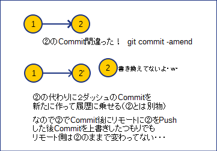
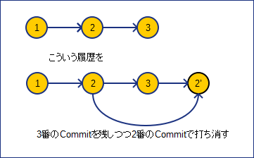
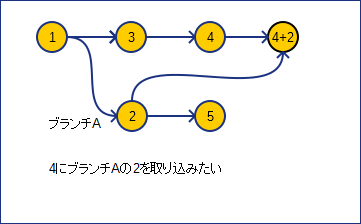
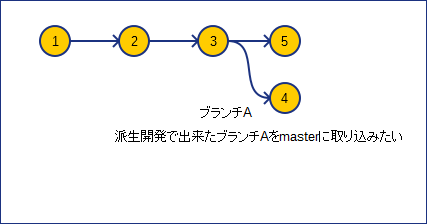
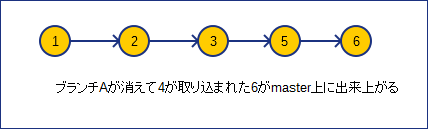

# 第2回Git勉強会

## こんなときどうする編
今までの説明以外で業務上起こりうるよくあるパターンをやってみましょう

## 1.変更をなかったコトにしたい
どんなケースか  
「前回のコミットからソースをいじったけどコミットせず元に戻したい」  
・git checkout .   
これで現在のディレクトリ下のファイルを戻せます。  

そのほかにも指定ファイルを元に戻す事が可能です  
git checkout [ファイル名]  

```
$ vi ccc.txt
「作業：viで新規ファイルを作成」
$ ls
ccc.txt
$ git add ccc,txt
$ git commit -m test
「作業：新規ファイルのcommit」

$ vi ccc.txt
「作業：viでファイルの内容を修正」

$ git diff
diff --git a/ccc.txt b/ccc.txt
index 259b241..543209f 100644
--- a/ccc.txt
+++ b/ccc.txt
@@ -1,2 +1,4 @@
 test
 test1
+test
+test1
warning: LF will be replaced by CRLF in ccc.txt.
The file will have its original line endings in your working directory.
$ git checkout ccc.txt
「作業：修正したファイルを元に戻す」

$ git diff
```

## 2.直前のコミットを変更したい
コミットした後チェックしたら過不足があって「直前」のコミットを書き換えたい場合  
git commit --amend  
（git commit --amend -m ～　でコミットメッセージも記載できます）  
以下使い方

```
$ vi bbb.txt
「作業：新規のファイルbbb.txtを作成する」

$ vi ccc.txt
「作業：新規のファイルccc.txtを作成する」

$ git add bbb.txt
$ git commit -m test3
「作業：新規ファイルのcommit（ccc.txtを入れるのを忘れておく）」

$ git log
commit 6f6896dfa38c69c41466ecd32d7d12c3731c07ec
Date:   Mon Feb 22 21:41:00 2016 +0900

    test3

commit 4907d6f937487ef01305639c0724b626074f6fb3
Date:   Thu Feb 18 08:53:02 2016 +0900

    test

「作業？：・・・しまった！ccc.txt入れるの忘れてた！と気が付く」

$ git add ccc.txt
$ git commit --amend -m test3fix
「作業：直前のcommitを書き換える」

$ git log
commit 395fee5fc8ced25fd7404887f41fa2b978ced23b
Date:   Mon Feb 22 21:41:00 2016 +0900

    test3fix

commit 4907d6f937487ef01305639c0724b626074f6fb3
Date:   Thu Feb 18 08:53:02 2016 +0900

    test
```

要注意なのはコミット自体の変更ではなく新しくコミットを作って履歴上置き換えています。  
（--amendする前後のcommitIDが違うことに注意してください）  
※CommitIDは、「git log」で表示された「commit ～」の～部です。





その為、リモートにPushした後使用するのは禁止している所が多いです。  
これはgit reset（Commitの取り消しコマンド）も同じです。

## 3.コミット済みのスナップショットを元にもどす
コミットしたけど仕様上不要になって何個か前のコミットまで戻したいケース  
やり方が2個あります。  

git revert [CommitID]  


```
$git revert (3のCommitID)
```
もう一つは  
git reset [CommitID]  
で  


```
$git reset (2のCommitID)  
```
で２まで取り消します。（３の履歴はなくなります）

resetは「取り消し」でrevertは「打ち消し」

## 4.取り置きしたい
git stash
どんなケースか  
「新しい開発中に前の環境でバグがあったとかで環境を戻す羽目に（作業中のはどっかに置いておきたいよ。。。）」  
１）保存する　　　：git stash    
２）保存リストを見る：git stash list  
３）保存したデータに戻す（戻すときに元のデータは消す）  
git stash pop stash@{1}  
４）保存したデータに戻す（戻すときに元のデータは残す）  
git stash apply stash@{1}  
５）指定の保存stashを消す  
git stash drop stash@{1}  
６）保存stashを全部消す  
git stash clear  
※上の「stash@{1}」は省略可能で、その場合stash@{0}つまり最新を指すことになります。   

```
$ vi aaa.txt
「作業：新規ファイルaaa.txtを作成する」
$ git add aaa.txt
$ git commit -m test1
$ git log
commit fbc930f7ee8a39be2ab15b83c06bbe0fa8228fda
Author: root <root>
Date:   Tue Mar 15 02:41:15 2016 +0900
    test1
「作業：新規ファイルをcommitする（リリースした）」

$ vi aaa.txt
「作業：さらにviでファイルの内容を追加修正」
「イベント：作業中にバグが出たから前のファイルに戻して解析してほしいと依頼発生」
「追加修正作業は残しておきたい」

$ git stash
Saved working directory and index state WIP on master: fbc930f test1
HEAD is now at fbc930f test1
「作業：修正中の状態を別に取り置きする」

$ git stash list
stash@{0}: WIP on master: fbc930f test1
「作業：取り置きした一覧を確認」

「取り置きできたので前のコミットに戻して解析作業をする」
$ git checkout fbc930f7ee8a39be2ab15b83c06bbe0fa8228fda

「終わったので戻とそう・・・」
$ git stash pop
On branch master
Changes not staged for commit:

        modified:   aaa.txt

Dropped refs/stash@{0} (2d69d9128ea1b3a318d7e2aa95ed46f1b1954d8b)
「作業：取り置きファイルから戻す（popは戻した後取り置きファイルは消えます）」
$ git stash list
「空」
$
「作業：popで戻したのでStashのリストが消えていることを確認」

「作業：戻ったかどうかvi等で確認する」

```

## 5.特定のコミット適用
git cherry-pick [CommitID]  
どんな目的使うかというと

  
以下、実行例です（masterとbranch Aが既に作成済みからスタート）  

```
 ~/testgit (master)
$ vi bbb.txt
$ git add bbb.txt
The file will have its original line endings in your working directory.
$ git commit -m test2
[master 232ea97] test2
The file will have its original line endings in your working directory.
 1 file changed, 2 insertions(+)
 create mode 100644 bbb.txt
$ git log
commit 232ea97fc21ef26bbaf1744eff616a00a5c9b24b
Date:   Tue Feb 23 01:54:08 2016 +0900
    test2
commit 672d318f18cdce8f6c9b5f1b3e9e764f0b692a2b
Date:   Tue Feb 23 01:30:47 2016 +0900

    testcommit001
$ git checkout A
Switched to branch 'A'
 ~/testgit (A)
$ ls
aaa.txt
$ cat aaa.txt >> ccc.txt
$ git add ccc.txt
The file will have its original line endings in your working directory.
$ git commit -m testA
[A ec8ce9d] testA
The file will have its original line endings in your working directory.
 1 file changed, 2 insertions(+)
 create mode 100644 ccc.txt
※注）図の２のコミットにあたります

$ git log
commit ec8ce9da5aa8bc6eb75e1f1ead648f5bfd56098a
Date:   Tue Feb 23 01:55:12 2016 +0900

    testA

commit 672d318f18cdce8f6c9b5f1b3e9e764f0b692a2b
Date:   Tue Feb 23 01:30:47 2016 +0900

    testcommit001
$ git checkout master
Switched to branch 'master'
~/testgit (master)
※注）図の４にもどしています

$ ls
aaa.txt  bbb.txt
$ git cherry-pick ec8ce9da5aa8bc6eb75e1f1ead648f5bfd56098a
[master ffcea66] testA
 Date: Tue Feb 23 01:55:12 2016 +0900
 1 file changed, 2 insertions(+)
 create mode 100644 ccc.txt
※注）図の２のCommitIDを指定してcherry-pickを行っています

$ ls
aaa.txt  bbb.txt  ccc.txt
$ git log
commit ffcea669a49b05574279f3d73469ae4520e0b9bf
Date:   Tue Feb 23 01:55:12 2016 +0900

    testA

commit 232ea97fc21ef26bbaf1744eff616a00a5c9b24b
Date:   Tue Feb 23 01:54:08 2016 +0900

    test2

commit 672d318f18cdce8f6c9b5f1b3e9e764f0b692a2b
Author: root <root>
Date:   Tue Feb 23 01:30:47 2016 +0900

    testcommit001
```

## 6.ブランチの根本変更
git rebase  
どんなケースか  

  
git checkout A  
とした後に  
git rebase master  
と打つと  


rebase -i  
で過去のCommitをまとめることもできます

## 7.エイリアス登録
どんなケースか
コマンドのオプションが結構長い  
例）git log --pretty=format:"[%ad] %h %an : %s"  
毎回打つの辛い・・  
エイリアス登録しておいて  
git config --global alias.olog 'log --pretty=format:"[%ad] %h %an : %s"'  
と登録しておけば  
git olog   
だけで実行できます  

## 演習問題
1. 任意のファイルを編集した後、編集する前の状態に戻してください。
* 任意のファイルを編集し、任意のコメントを付けてコミット後、コミットしたコメントを「コメントを修正しました」に修正してください。
* masterブランチからdevelopBブランチを作成し、developBブランチにtest1.htmlを作成してください（コミットはしない）。それを取り置きしてmasterブランチに切り替えてください。その後、再度developBに切替えを行い、取り置きしたtest1.htmlの追加を適用してください。
* developBブランチに切替え、test2.htmlを追加してコミットしてください。その後、さらにtest3.htmlを追加し、コミットします。masterブランチに切替え、test2.htmlを追加したコミットのみをmasterブランチに適用してください。
* git statusのコマンドをエイリアス登録してgit stでも編集ファイルの状態が確認できるようにしてください。
